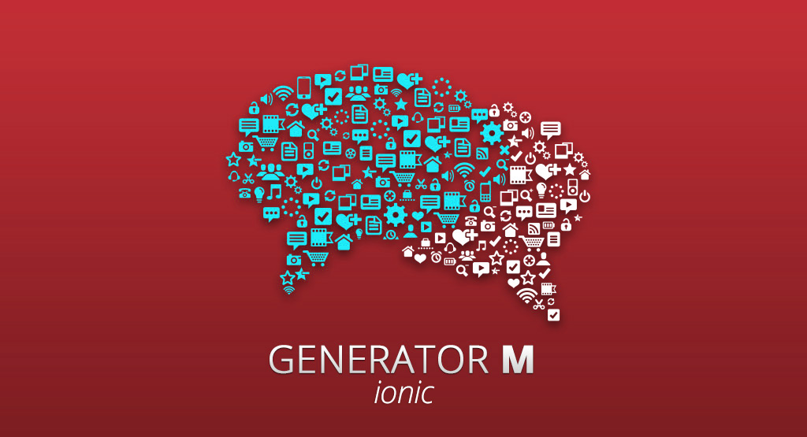

> Published September 10, 2015 on the [M-Way Solutions Blog](http://blog.mwaysolutions.com/2015/09/10/generator-m-ionic-html5-mobile-app-development-evolved/).

# Generator-M(-Ionic): HTML5 mobile app development evolved

Almost a year ago, ditching development of our own mobile framework lead to the genesis of [Generator-M](https://github.com/mwaylabs/generator-m) - our advanced open-source generator for HTML5 mobile apps. Since then it's been receiving increasing support from the community and we are enjoying very much to see it grow. Today we're announcing a new feature-packed version `1.3.0` and a new name for the project: namely [Generator-M-Ionic](https://github.com/mwaylabs/generator-m-ionic). Find out why we think the new name better reflects the direction our generator is heading into and why it should be your first choice for professional HTML5 mobile app development with Ionic.

## What's the generator?
If you are new to developing with the generator or the concept of generators itself, make sure to check out the [Yeoman Website](http://yeoman.io/) for a brief introduction.

Being entirely built with [node.js](https://nodejs.org/en/) our generator plugs together a HTML5 mobile development stack using all the great open source technologies of the web ecosystem. These are used worldwide to successfully build high-quality software. [Yeoman](http://yeoman.io/) is used to scaffold your app, [Gulp](http://gulpjs.com/) to run a huge variety of development, testing, build and integration tasks, [Bower](http://bower.io/) manages frontend dependencies, [Sass](http://sass-lang.com/) gives superpowers to your CSS and finally [AngularJS](https://angularjs.org/) is the JavaScript MV*-framework of choice. On top of that the generator adds the following technologies to leverage mobile development: [Cordova](http://cordova.apache.org/) granting access to native mobile features via JavaScript and the [Ionic Framework](http://ionicframework.com/) provides mobile capabilities by closing the gap between AngularJS, Cordova and Sass/CSS.

For a first contact with Generator-M-Ionic the [Readme](https://github.com/mwaylabs/generator-m-ionic) on our repository should get you started.

## Where are we coming from?
Before we get into the details of the new release and the renaming of Generator-M to Generator-M-Ionic let's have a quick review of the generator's history and make sure we all know what we're talking about.

After silently developing the first couple of version of Generator-M mainly as an internal tool, we decided that it is time to publish the first stable major release, version `1.0.0`, earlier this year. Thus giving back to the community our business depends on. Along the lines of these events we summarized all the developments that lead to the initiation of Generator-M in this [blog post](http://blog.mwaysolutions.com/2015/03/26/generator-m-the-state-of-html5-mobile-app-development-at-m-way/) from March 2015.

Besides profiting ourselves from the more express development workflow the generator endorses, in passing we also realized it made us more valuable contributors to the open source community. In turn, this not just made us better developers but also more attractive and successful as a company. Embracing what's already there and building on top of that, made us more powerful and efficient rather than letting us fall prey to a culture of *not invented here (NIH)* and *yet another framework syndrome (YAFS)* with which we were finding ourselves reinventing the wheel on various occasions. A great article on why you should rather contribute than reinvent was published on [medium](https://medium.com/@tastejs/yet-another-framework-syndrome-yafs-cf5f694ee070) by Addy Osmani, Sindre Sorhus, Pascal Hartig, Stephen Sawchuk and Colin Eberhardt. If you haven't read it, I highly recommend it!

This philosophy still is a driving factor in the development of the generator and impacts nearly each and every one of our decisions on that matter. You'll see how, when we are comparing our generator to some of the alternatives which are out there, in a [new blog article](https://github.com/mwaylabs/generator-m-ionic/wiki/Why-the-generator%3F) which will be released in a couple of days.

## Where are we now?
Since the release of version `1.0.0` we've been able to gain a lot of new insights through  feedback from the community and by heavily working with Generator-M ourselves. All this valuable experience shaped the development of the generator and besides giving it more features, added to a more and more concise and professional workflow.

### Generator-M-Ionic
In the course of this, we came to the conclusion that while initially we were not sure about the [Ionic framework](http://ionicframework.com/) being our mobile framework of choice for long enough to brand our generator after it, we now more than are. Ionic is definitely here to stay especially since they have received a second round of a [serious $2.6 million funding](http://techcrunch.com/2015/03/30/drifty-grabs-2-6-million-to-turn-web-developers-into-mobile-app-makers/) earlier this year. Of course there are other interesting choices for mobile HTML5 development for example [React Native](https://facebook.github.io/react-native/) which is being developed by Facebook and built on top of [React](http://facebook.github.io/react/) instead of AngularJS. However our [company's strategy](http://blog.mwaysolutions.com/2015/04/10/the-future-of-angular/) in regards to AngularJS is speaking a clear language. Moreover the community that has built around the generator and its code base now are so tightly and carefully integrated with AngularJS and Ionic that we would rather create a new generator than to force a new technology on this one. Needless to say we are always keeping our minds open for new tech and have our eyes closely on the market, we even may embrace React or a different strategy in the long run, but for this generator the era of rapid and hasty changes is over. Instead, we are closing that door in order to make this generator a more stable and reliable companion for you. Entirely focused on mobile app development with AngularJS and Ionic.

We think this is a commitment worthy of a name-change, so without any  further ado, Generator-M from now on is officially called:

\* **drumrolls** \*

Generator-M-Ionic

\* **confetti** \*

Perhaps, this is a good moment to point out why we are so proud of Generator-M-Ionic in general and in particular its version `1.3.0`. And incidentally why you should start using it for your HTML5 mobile app development.

Version `1.3.0` brought substantial improvements, for a full list refer to the [release notes](https://github.com/mwaylabs/generator-m-ionic/releases). Besides that, here's a general overhaul of why we think, Generator-M-Ionic is the best tool for HTML5 mobile app development:

1. builds up your whole development stack in no time
  - once set up, two commands suffice and you have a working app running on your phone or browser: type `yo m-ionic` and `gulp watch` to run in the browser
  - for a quick first impression check out our [demo repository](https://github.com/mwaylabs/generator-m-ionic-demo)
1. plugs together all the great and established web dev technologies
  - introduces you to the ecosystem and enables you to use it (instead of hiding it from you, more on that in our [next blog article](https://github.com/mwaylabs/generator-m-ionic/wiki/Why-the-generator%3F).
1. maintained by us and we use it every day, so it's not going to disappear. Thus:
  - stays up to date with the most recent developments of the ecosystem - check out our [dependencies](https://david-dm.org/mwaylabs/generator-m-ionic)!
  - we pay close attention to quality and the generator is extensively [tested](https://github.com/mwaylabs/generator-m-ionic/tree/master/test) with [mocha](https://mochajs.org/) and has [97% code coverage](https://coveralls.io/github/mwaylabs/generator-m-ionic) while adhering to our [ESLint](http://eslint.org/) JavaScript [style checks](https://github.com/mwaylabs/generator-m-ionic/blob/master/.eslintrc)
  - since we use it as a production tool, you don't have to fear hasty and uneducated changes, while we do try to keep up with the latest development, we only do so if there's a good reason and after having thoroughly considered the change. For example our latest release made a switch from other technologies to [ESLint](http://eslint.org/) and [Browsersync](http://www.browsersync.io/) but there are [good reasons](https://github.com/mwaylabs/generator-m-ionic/releases/tag/1.3.0) for it and the upgrade cost is marginal
1. has a growing and active community and user base
  - earlier this week we reached [more than 800 downloads](https://github.com/mwaylabs/generator-m-ionic#generator-m-ionic) during the last month via [npm](https://www.npmjs.com/)
  - there's a growing number of contributions in issues, discussions and pull requests
  - in an average two weeks, the repository has roughly 400 visitors and about 2,800 views
  - Github stars? - [See for yourself](https://github.com/mwaylabs/generator-m-ionic/stargazers)
  - granted, this is good but not quite where we imagine it to be, but we focused on making our generator great before we now start making it more visible
1. increasingly better documentation, guides and beginner tutorials (we're working on this too!)
  - check out our new [guides](https://github.com/mwaylabs/generator-m-ionic#guides)
2. provides a very elaborate and professional workflow from start to finish
  - efficient development tools ensure painless coding, configuring and building: [livereloading in the browser](https://github.com/mwaylabs/generator-m-ionic#get-started), [a series of subgenerators](https://github.com/mwaylabs/generator-m-ionic#sub-generators) and  [a powerful collection of gulp tasks](https://github.com/mwaylabs/generator-m-ionic#more-gulp-tasks) with JavaScript, CSS and image minification, source-mapping and a lot of other great stuff
  - a featureful [testing workflow](https://github.com/mwaylabs/generator-m-ionic#testing) with [Karma](http://karma-runner.github.io/), [Protractor](https://angular.github.io/protractor/#/) and [code style checks with ESLint](https://github.com/mwaylabs/generator-m-ionic/blob/master/docs/guides/eslint.md)
  - a fine-tuned integration with [Git](https://git-scm.com/) version control lays out the foundation for professional development. Learn how, in the Generator-M-Ionic's [Readme](https://github.com/mwaylabs/generator-m-ionic#git-integration), or check out why you should use it in this fantastic [Git blog series](http://blog.mwaysolutions.com/2015/07/16/a-short-introduction-to-git/) written by one of my colleagues which was even featured on [smashing magazine](http://www.smashingmagazine.com/2015/08/web-development-reading-list-100/#tools)
1. last but definitely not least: delivers seasoned and established tools for building your apps in complex continuous integration processes:
  - create different [configurable environments](https://github.com/mwaylabs/generator-m-ionic#gulp-environment) for production, testing or other environments
  - fully flexible process of integrating [app icons and splash screens](https://github.com/mwaylabs/generator-m-ionic/blob/master/docs/guides/icons_splash_screens.md)
  - a [guide](https://github.com/mwaylabs/generator-m-ionic/blob/master/docs/guides/programmatically_change_configxml.md) on how to building different configurations of your apps in a continuous integration environment with `gulp config` and `buildVars`

That's it! - Still hungry? So are we!

## Where are we heading?
We still have many more [features and ideas](https://github.com/mwaylabs/generator-m-ionic/labels/feature) in the pipeline. A lot of [version 1.4](https://github.com/mwaylabs/generator-m-ionic/milestones/1.4.0), which will be the next release is about making the generator more accessible. We'll spawn a lot of documentation, guides and tutorials for that matter. Long-term, the support for [ES6](https://github.com/lukehoban/es6features) and [Angular 2](https://angular.io/) and [Ionic 2](http://blog.ionic.io/angular-2-ionic/) respectively are going to be big changes but both of these are probably not going to become relevant before the end of the year.

If you want to get involved in the process or want to give Generator-M-Ionic a try our [Github repository](https://github.com/mwaylabs/generator-m-ionic) or our [Gitter chatroom](https://gitter.im/mwaylabs/generator-m-ionic) are the best places to start!

Stay tuned for [next week's article](https://github.com/mwaylabs/generator-m-ionic/wiki/Why-the-generator%3F) which will dive into a comparison of Generator-M-Ionic and similar tools and give more insights behind the reasons why we started to develop the generator in the first place.

Happy coding and see you next week!
