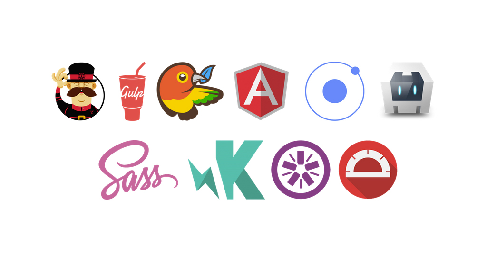

> Originally published September 21, 2015 on the [M-Way Solutions Blog](http://blog.mwaysolutions.com/2015/09/21/generator-m-ionic-and-the-search-for-the-holy-grail/).

# Generator-M-Ionic: and the search for the holy grail

... of HTML5 mobile app development, that is. Learn how our generator compares to other solutions out there and what an important role it plays in our software development process.

[Last week](https://github.com/mwaylabs/generator-m-ionic/wiki/Name-Change) I wrote about the recent name change and gave a summary of the latest release and the direction we're heading into with the generator. This week we'll discover, why we decided to create our own generator in the first place and why to this day we think it's important we keep doing so. As we are trying to strengthen the Generator-M-Ionic's popularity and user base, it is important to ask ourselves again what its UVP (unique value proposition) is, especially in comparison to the two most popular other tools out there: the [Ionic CLI](http://ionicframework.com/getting-started/) and the [generator-ionic](https://github.com/diegonetto/generator-ionic). Why should anybody consider (and that includes us) using our generator instead of these tools? - In the course of this comparison we may get a little technical but in the end, that's our business. Nevertheless I'll keep it as brief as possible. Promised.

## Why not use something else?
The former alternative (Ionic CLI) is being developed by Ionic and is a great tool for beginners, but we got stuck on many occasion when we tried to integrate the CLI in our professional workflow. The latter (generator-ionic) was released by an open source member and it quickly grew immensely popular, however it [hasn't been maintained in over 5 months](https://github.com/diegonetto/generator-ionic/commits/master) (as of the writing of this article) and thus its dependencies are [heavily outdated](https://github.com/diegonetto/generator-ionic/blob/master/package.json#L30) and development came to a complete halt. Issues and pull requests are piling up, but nothing seems to happen.

One of the reasons we started development of Generator-M in the first place was that we felt [Ionic CLI](http://ionicframework.com/getting-started/) was adding too much magic, effectively hiding the whole ecosystem behind a rainbowy cloud. Granted, this makes things easier to begin with, but also keeps you from taking your development to the next level once you mastered the basics. You'll depend on that rainbowy cloud which has limited capabilities. Don't get me wrong. The Ionic CLI is a powerful tool for beginners and thus definitely serves its purpose. It just doesn't meet our demands for professional software development. Let me explain:

For instance the Ionic CLI provides commands to manage Cordova platforms for which you want to develop (iOS, Android, Windows, ...) and their plugins. However there's already a perfectly fine tool that already does just that: the [Cordova CLI](https://cordova.apache.org/docs/en/edge/guide_cli_index.md.html#The%20Command-Line%20Interface) and it is maintained by Cordova so its features are always in sync with the latest Cordova developments.

Awesome!

But in case you are using the Ionic CLI you'll have to wait until they provide new features (in case they do so at all). In fact you might not even know they exist because by using the Ionic CLI you may not even have heard of Cordova in the first place, although under the hood they heavily depend on it. An occasion where being dependent on the Ionic CLI was unacceptable for us is the following: have you ever tried maintaining your Ionic projects with Git? - It's a nightmare!  You'll have to check in all the 3rd party code of the Cordova platforms and plugins unnecessarily bloating your repository and making your development process error-prone:

We've had developers manipulating 3rd party code in our repositories as quick-fixes. Why? - Because they could. A vicious circle began. We had an intense fear of updating Cordova or platform versions because this would ultimately break our apps, since all these "quick-fixes" were gone with the wind, once the update was done. Due to the commit histories being a mess because of all the library code that was in the repository, it was extremely hard to reproduce those "fixes". As a result, we rarely updated Cordova versions in our projects which eventually meant our projects would run on outdated and even vulnerable code.

No thank you!

The Cordova CLI on the other hand has a solution for this. It introduced support for managing your platform and plugin dependencies in version `5.0.0` using the `cordova prepare` command. This command installs all your dependencies, so you don't have to check them in anymore. In our eyes, this lays out a foundation for a much cleaner and more professional software development process.

That's why our generator enables you to use the Cordova CLI and integrates it  rather than reinventing what's already there and even possibly restricting your capabilities in doing so! As a result all of our projects now can easily be updated to the latest Cordova versions. It's usually just plug and play. How great is that?

With the Ionic CLI, you are stuck at checking in your 3rd party code or you'll have to build a custom solution (in fact that's what we did for the generator before Cordova 5.0 was released). But why should you, when the Cordova CLI already provides this feature?

So what about [generator-ionic](https://github.com/diegonetto/generator-ionic)? - Since it hasn't been maintained in a while it still runs on Cordova 4.2 and therefore also misses this so utterly important feature of managing your dependencies with the Cordova CLI. Too bad.

Another good example of that rainbowy Ionic CLI cloud standing between you and a more educated version of yourself is live-reloading in the browser. The Ionic CLI provides that capability, but instead of educating you how it's done it wraps that capability behind its CLI. Most projects use Gulp to perform tasks like these, and so does our Generator and in fact so does the Ionic CLI under the hood, but you won't notice that: effectively, teaching you nothing about Gulp and how awesome it is. And that's a pity because with Gulp you can easily create your own tools to develop, test and build your apps according to your specific needs.

Again there's nothing fundamentally wrong about that, it rather is a question of your priorities and how far you want to take HTML5 mobile app development.

The list of reasons for us is much longer, but I don't want to bore you with the details. The fact is that today, with Generator-M-Ionic we are already building apps in a complex continuous integration process and this process is refined on a daily basis. And that just isn't possible with any of the other tools. We wanted to build a tool that allows us to quickly prototype demos for customers but would also grant a seamless transition once this prototype evolved into a complex and large-scale scenario with multiple apps for different customers, brands, production and testing environments.

And with Generator-M-Ionic, we did just that.

So why should you use it? Because you can benefit from all that experience, for free, today. And in case you're not in sync with any of the decisions we made or will make down the road: the repository is actively maintained and if you are dedicated to get something useful upstream, you can create an issue and we are happy to help you in doing so.

No problem.

In that sense: get your hands dirty with Generator-M-Ionic, if you haven't done so already and let us know what you think of it!

Happy coding!
With [Generator-M-Ionic](https://github.com/mwaylabs/generator-m-ionic) of course! :)
