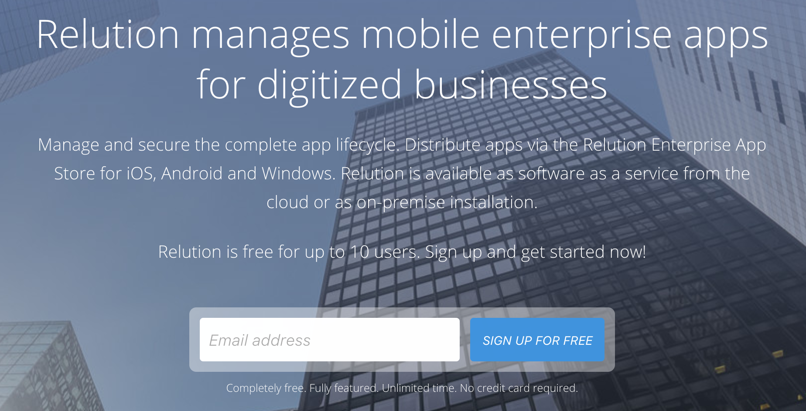
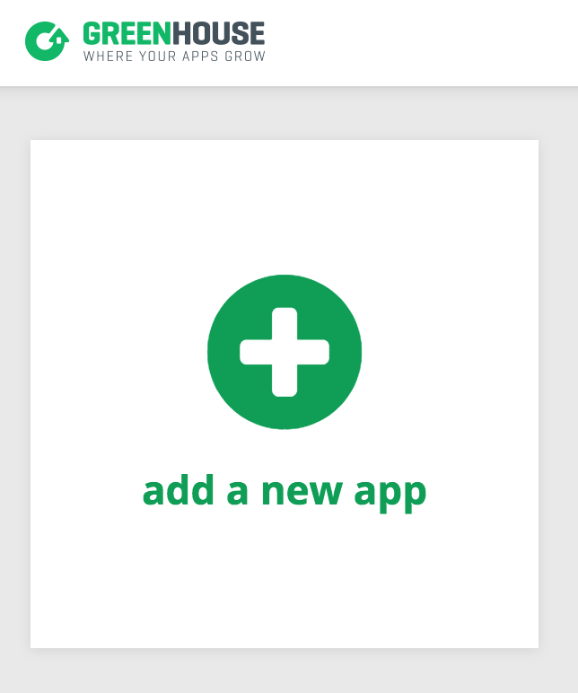
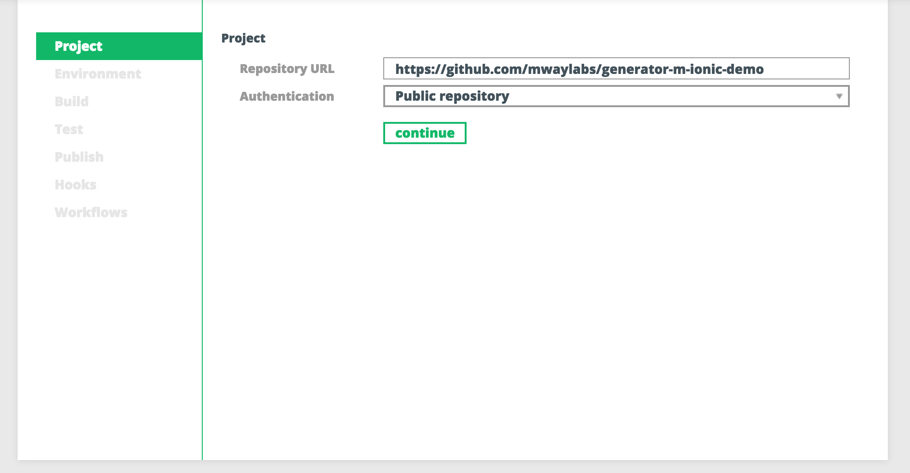
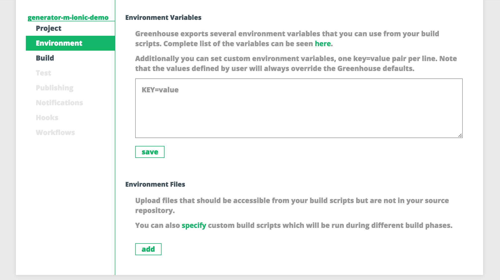
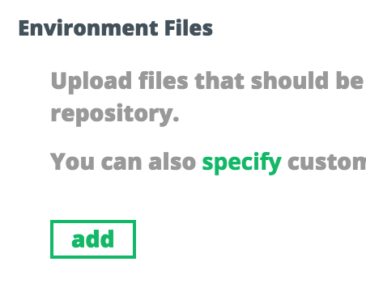
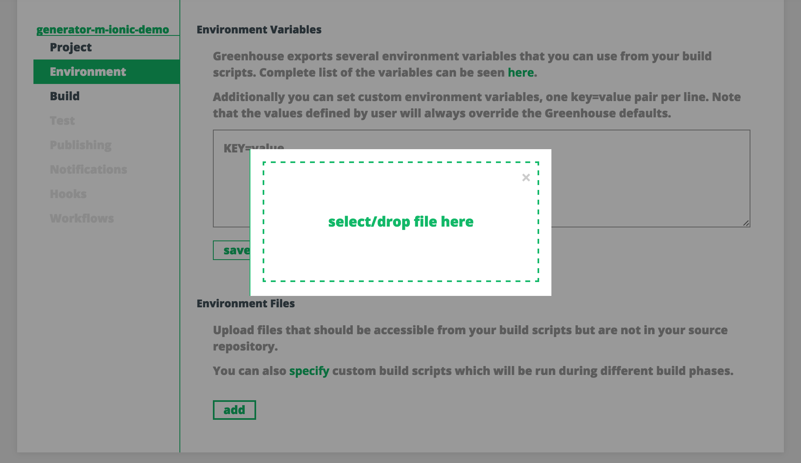
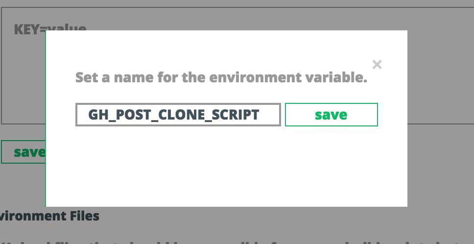

# Greenhouse CI & Relution
Learn how to build and distribute your Ionic app that you've set up with [Generator-M-Ionic](https://github.com/mwaylabs/generator-m-ionic) in this 20 minute guide using only free to use features. Build your app in the cloud using [Greenhouse CI](https://app.greenhouseci.com) and deliver them straight to your team members' and customers' devices with [Relution](https://www.relution.io/)!

## Preparations
What you need:
1. A working **[Generator-M-Ionic](https://github.com/mwaylabs/generator-m-ionic) project**
2. A **[Relution](https://www.relution.io/) Account** - the [free subscription](https://www.relution.io/en/pricing/) suffices
3. A **[Greenhouse CI](https://app.greenhouseci.com) Account** - [free plan](https://greenhouseci.com/pricing.html) is plenty

<p align="center">
  <br>
  <i>In your browser: create an account for Relution on  [relution.io](https://www.relution.io/)</i>
</p>

## Prepare your project
There's three options here:
- **Demo project**: Use the Generator-M-Ionic [Demo project on Github](https://github.com/mwaylabs/generator-m-ionic-demo) for now. You'll just need to copy the URL, no cloning with Git or anything: `https://github.com/mwaylabs/generator-m-ionic-demo`
- **New project**: Setup your own [Generator-M-Ionic](https://github.com/mwaylabs/generator-m-ionic) project. Checkout the [documentation](https://github.com/mwaylabs/generator-m-ionic#generator-m-ionic) to get started.
- **Existing project**: Use an existing project that you've set up with [Generator-M-Ionic](https://github.com/mwaylabs/generator-m-ionic)

In any case your Generator-M-Ionic project needs the `greenhouse.sh` build script. The demo project already contains this, if you chose this option, you'll have to do nothing. If you create a new project however, you need to select the `Greenhouse & Relution` option in the [Ecosystems Question](./questions.md#ecosystems). And for your existing project you can run the `greenhouse` sub-generator:
```sh
yo m-ionic:greenhouse
```
This will generate the `greenhouse.sh` for you.

## Build your app in Greenhouse
After you've prepared your project, created your Relution and Greenhouse accounts and signed into [app.greenhouseci.com](https://app.greenhouseci.com/#/login) and [live.relution.io](https://live.relution.io/relution/portal/#/login) using your browser, you can now create a new app in Greenhouse CI.

#### Create a new Greenhouse app
In the Greenhouse CI project overview, add a new app by clicking the `add a new app` button.
<p align="center">
  <br>
  <i>In your browser: create a new app on [app.greenhouseci.com](https://app.greenhouseci.com/#/login)</i>
</p>

Once you've done that, supply the URL to the repository you want to build in the initial project configuration as seen below. The URL for the [Generator-M-Ionic](https://github.com/mwaylabs/generator-m-ionic) Demo project is `https://github.com/mwaylabs/generator-m-ionic-demo`.

<p align="center">
  <br>
  <i>Greenhouse CI: initial project configuration for your new app</i>
</p>

Alternatively if you want to build your own project provide any other URL to a public repository or even add your private repository using [SSH or Basic Auth](http://docs.greenhouseci.com/docs/specify-git-repository). As long as your repository contains a project which was set up with [Generator-M-Ionic](https://github.com/mwaylabs/generator-m-ionic) this guide is right for you. For building other projects follow the [Greenhouse CI Documentation](http://docs.greenhouseci.com/docs).


#### Configure Greenhouse Environment
When you hit `continue`, the setup will jump right to the `Build` configuration. Navigate back to `Environment` to tell Greenhouse how to build your Generator-M-Ionic app:

<p align="center">
  <br>
  <i>Greenhouse CI: go back to `Environment`</i>
</p>

Click the `add` button under `Environment Files`:
<p align="center">
  <br>
  <i>Greenhouse CI: add an environment file</i>
</p>

Select or drag and drop the `greenhouse.sh` file of your project:

<p align="center">
  <br>
  <i>Greenhouse CI: upload `greenhouse.sh`</i>
</p>

And name it `GH_POST_CLONE_SCRIPT`:
<p align="center">
  <br>
  <i>Greenhouse CI: GH_POST_CLONE_SCRIPT</i>
</p>

This will tell the Greenhouse CI when and how to prepare your project for building according to the `greenhouse.sh` script of your project.


# Notes

4. Additionally, if you're building for iOS you'll need an Apple [signing certificate](https://developer.apple.com/support/certificates/) and [provisioning profile](https://developer.apple.com/library/ios/documentation/IDEs/Conceptual/AppStoreDistributionTutorial/CreatingYourTeamProvisioningProfile/CreatingYourTeamProvisioningProfile.html).


Granted, the Greenhouse CI integration for Generator-M-Ionic project is not ideal yet, but it works for now. Nevertheless we're looking to improve the whole process and make it more slick!

## Further
For further information on how to use Relution, head over to the [relution.io](https://www.relution.io) and in order to learn more about how to use the Greenhouse CI head over to their documentation on [docs.greenhouseci.com/docs](http://docs.greenhouseci.com/docs).
