# JSConf EU 2017 - People first. Always.

  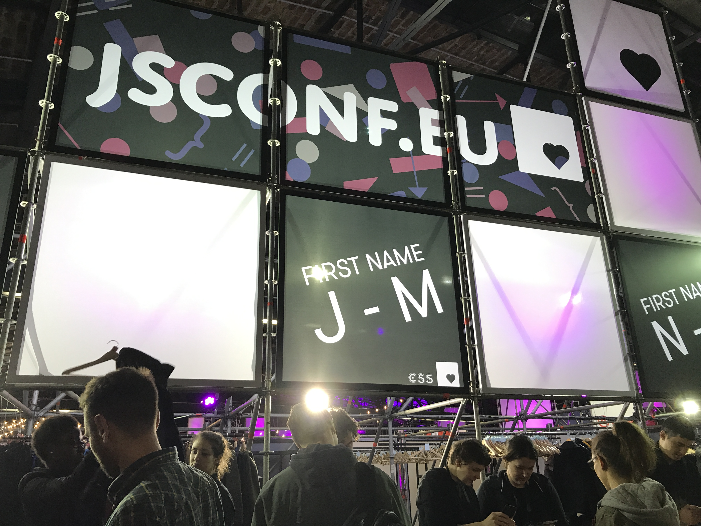

About two weeks ago, finally, the glorious and highly anticipated [JSConf EU](http://2017.jsconf.eu/) took place. You may have heard! Right here at the heart of the universe, Berlin. May 6 through 7. And it was totally-super-frickin-awesome.

Maybe you couldn't go and are super jealous or maybe you did go and just want to bathe yourself in some nice memories. No matter, you've come to the right place!

## Getting ready.

Having JavaScript at the top of my technology-stack for more than 8 years as a Software and Open Source Developer, I knew I had to go. Absolutely. My manager at Nolte&Lauth made the necessary arrangements, and thus I had the amazing opportunity to be one the 1000 people coming together from all over the world for everything concerning JavaScript. And, boy, was I excited and boy, did I not know how bombastically awesome it was going to be!

But let's back up a little.

In late 2016, I learned about JSConf EU taking place through their [open call for speakers](http://2017.jsconf.eu/call-for-speakers/). Literally everyone could submit a proposal and through a carefully conducted selection process, the [amazing team](http://2017.jsconf.eu/about/) behind JSConf EU  ([@cramforce](https://twitter.com/cramforce), [@hblank](https://twitter.com/hblank), [@janl](https://twitter.com/janl), [@fox](https://twitter.com/fox)) came up with an [incredible line-up of speakers](http://2017.jsconf.eu/speakers/) chosen out of more than 600 submitted proposals.

A few months prior to the conference they kept announcing one speaker after another and with every new announcement my heart-rate went up. It just kept getting better and better, the topics and speakers (as you'll soon see) were so much more diverse than I expected. Yes!

I got so excited, the week before the conference, I made sure everybody at my company knew that I was going to JSConf EU and that is was going to be fantastic. I got my business cards ready, polished [my twitter account](https://twitter.com/jonathangrupp) and made a note for our office door. EVERYBODY NEEDS TO KNOW!

  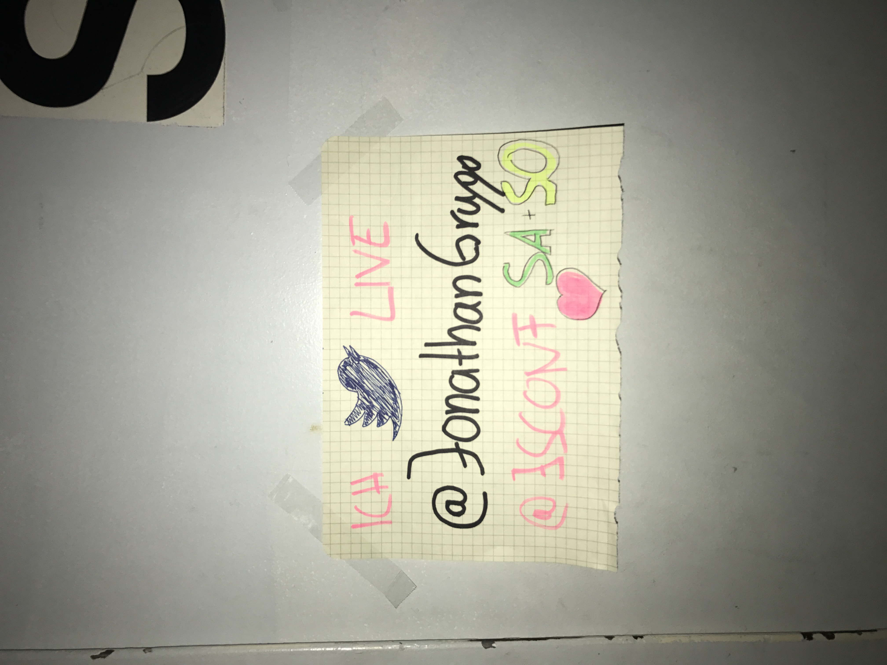

Did they understand what I was talking about? - No.  
Did I annoy all of them? - Yes.  
Did I care? - Not at all!  

*"Jonathan, do you have the files for that thing I need?"* - *"No Jenni, but I can tell you what I do have. A file containing a ticket for JSConf!"*

*"Jonathan, can you give me feedback on the design changes I made?"* - *No Lars, but I can give you a really long twitter feed on why JSConf is awesome!*

"*Jonathan, do you want to join us for lunch?"* - *"No Kathrin, but do you know where they will also have really good lun..."* - **Shut up, Jonathan.**

## The day has come.
May 6, public transport to [Arena Berlin](http://www.arena.berlin/), 8:15 and by the way to early for a Saturday morning. Am I on the right bus?

I look around: trendy Herschel backpacks, authentic nerd glasses and a curly-haired woman reminiscing: *"... and then I realized how cool DHTML was back in the days!"*

I'm on the right bus.

  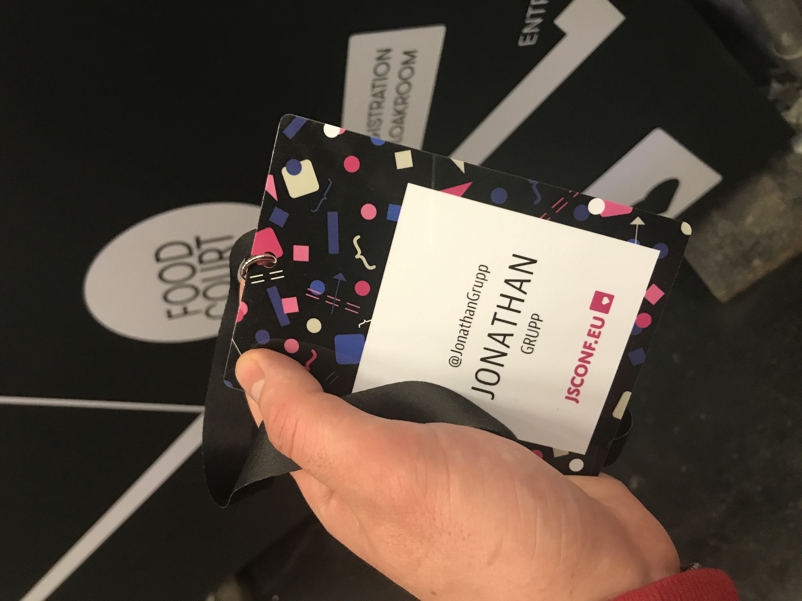

  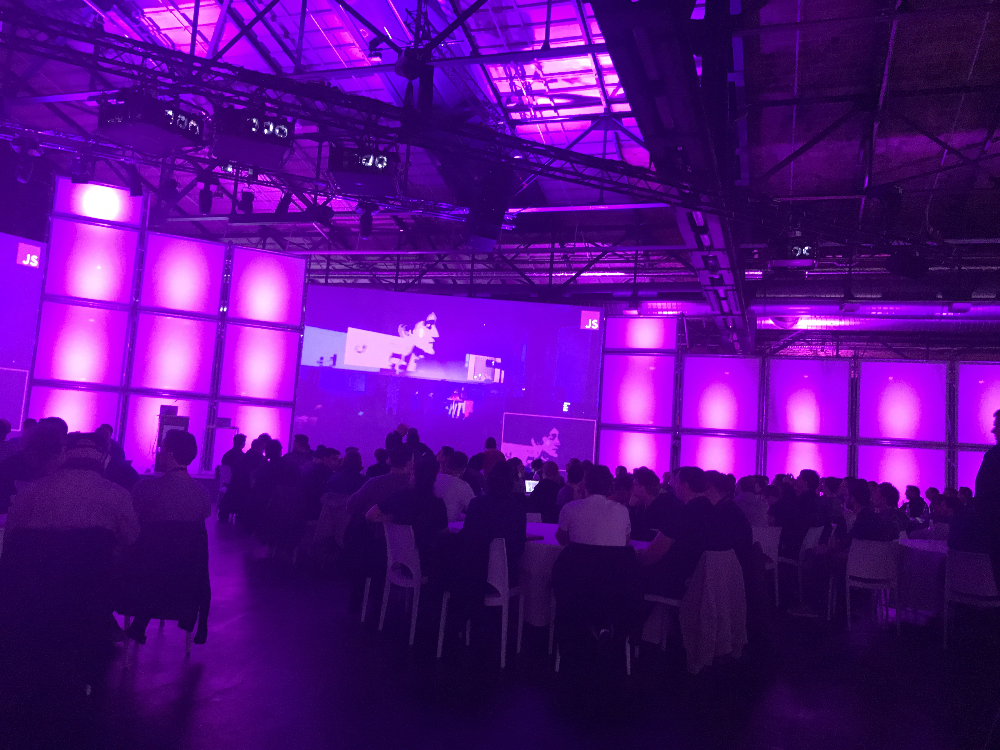

  

  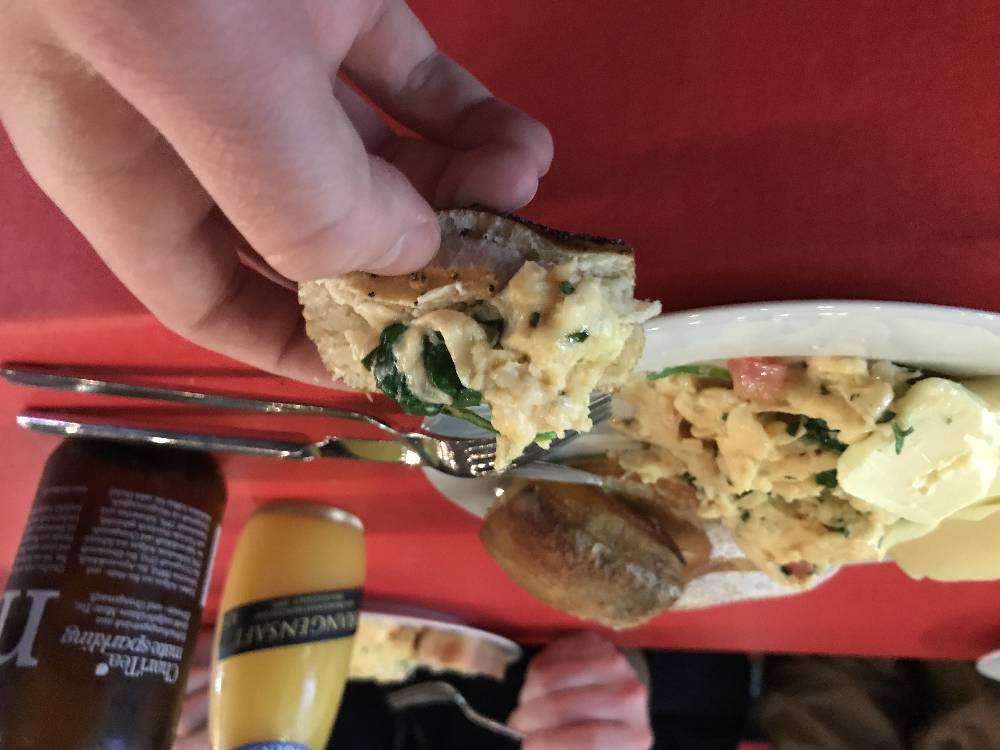

I meet Suz [@noopcat](https://twitter.com/noopkat) from Brooklyn who goes on to tell me about her friend who organizes [brooklyn.js](http://brooklynjs.com/), we get inside, everything is purple and blue, I get my badge and then - thank god there's breakfast - I chat with Sonja who's here with her colleagues from Amsterdam. Hipster-beards, neon-blue undercut hairstyles, gender-neutral bathrooms and an appealing assortment of organic lemonade and other beverages everywhere.

Wow, ohh... do I feel at home!

9:27, suddenly a booming smooth bass comes from the speakers, everybody turns their head. Add a pleasant robot voice: "JAVASCRIPT - PEOPLE GOT MAD". [@nested_loops](https://twitter.com/nested_loops) open JSConf with their amazing audio-video and light performance.

All done live, with...
Guess what?

  

JavaScript! (Yes even the lights of the whole conference stage!)

You can see the full video on the [JSConf Youtube Account - opening JSConf EU 2017](https://www.youtube.com/watch?v=lCn-XCASn98) and even the talk where they [explain how they did everything](https://www.youtube.com/watch?v=NpKLt_YO3o8).

## Day one in JavaScript wonderland
Admittedly the hardest part was deciding which talks I wanted to see. Because, well, ... I wanted to see all of them! However, as you know, we all have to make possibly life-changing decision at some points in our lives and [@philnash](https://twitter.com/philnash)'s Service-Worker-powered, offline-ready version of the [JSConf EU 2017 schedule](https://jsconf.philna.sh/) sure helped me to make the proper ones.

Add that to your mobile's home screen and no worries about internet-connectivity and spotty wifi-connection for the whole weekend! How cool is that?

Unfortunately, I had an even harder time deciding which talks to write about in this blog post. There were just so many good ones. Hence, please regard the following as a best effort and a compromise between the awesomeness of the talk and the availability of resources for you to look at. The [JSConfEU youtube channel](https://www.youtube.com/user/jsconfeu) is currently updated with videos every couple of days, so be sure to check it out!

Let's dive in!

#### Addy Osmani - The browser hacker's guide to instantly loading everything
After the grand opening, the conference was kicked-off by no one less than Google's [Addy Osmani](https://addyosmani.com/) ([@addyosmani](https://twitter.com/addyosmani)) with his content-packed talk about page loading performance. My two most important takeaways to look at: Google's [Lighthouse](https://developers.google.com/web/tools/lighthouse/) automation tool and a curated list of articles on that topic at  [medium.com/reloading](https://medium.com/reloading).

  

"Performance is a continuous game of measuring for areas to improve"

#### Anjana Vakil: Immutable data structures for functional JS
Can a simple rock serve as a useful metaphor for programming constructs? Yes indeed: Anjana Vakil ([@AnjanaVakil](https://twitter.com/AnjanaVakil)) shows us how with her emoji-filled introduction to immutable data structures and immutability in general.

  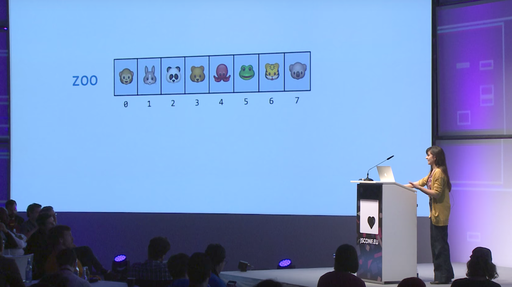

While talking about the benefits (no unexpected changes!) and the challenges (copying data wastes time & space) that come with implementing immutable data structures she also explores [mori](https://github.com/swannodette/mori) and Facebook's [Immutable.js](https://facebook.github.io/immutable-js/) as two viable choices for working with immutable data structures in JavaScript.

Her whole talk is available on [youtube](https://www.youtube.com/watch?v=Wo0qiGPSV-s)!

#### Ruth John: How To Be A Web A/V Artist
*"Winamp - it really whips the Llama's ass!"* - do you remember that [phrase](https://www.youtube.com/watch?v=HaF-nRS_CWM)? You probably do, if you were trying to play mp3s on your computer about 15 years ago. If so, you might also remember Winamp Media Player's awesome [live visualization feature](https://www.youtube.com/watch?v=-34Qqd0mAfo) that reacts to the music/sounds you are playing.

Ruth John's ([@Rumyra](https://twitter.com/Rumyra)) enchanting talk does exactly that but way cooler and also in the browser. IN REAL-TIME! Visualizations reacting to her voice, the music, the audience. She does all sorts of cool A/V stuff in the browser together with the other members of the [live:js collective](http://livejs.network/).

  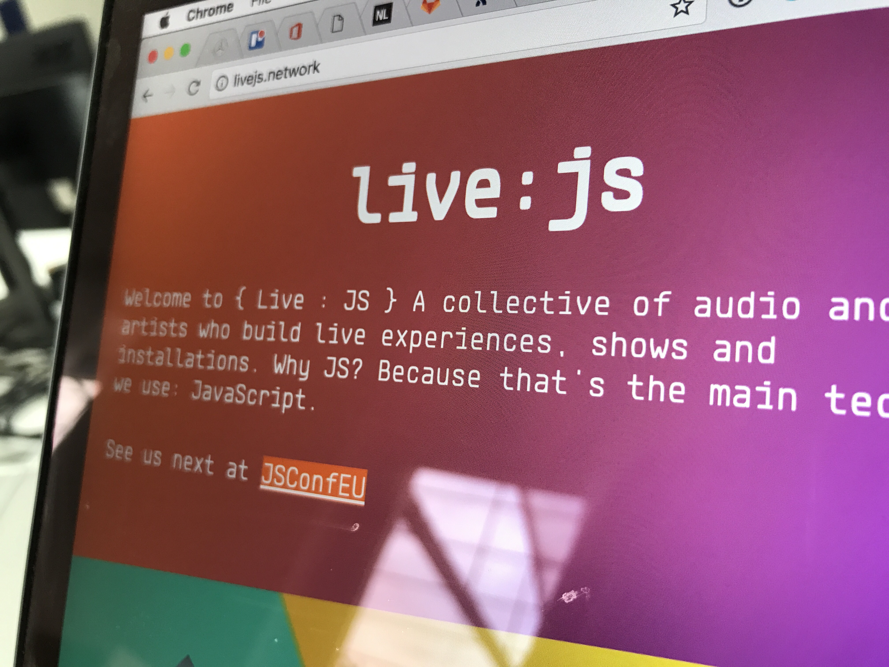
  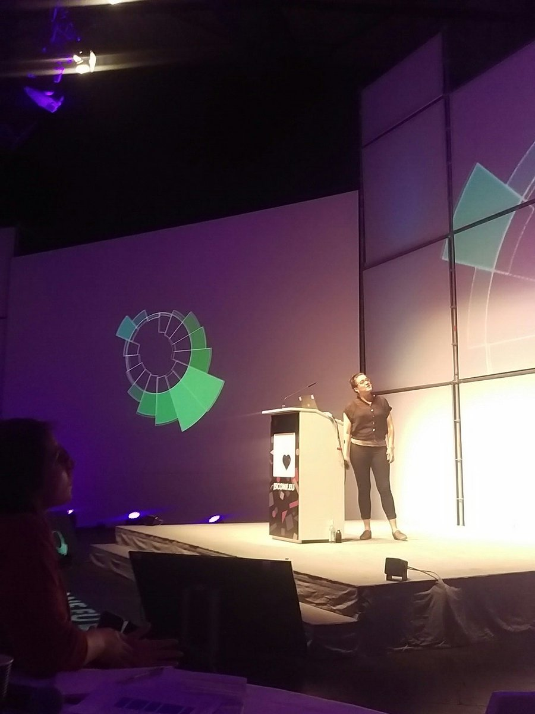

Unfortunately, her talk is not available on the [JSConf youtube channel](https://www.youtube.com/user/jsconfeu) (yet?), I'll let you know of any updates!

#### Ashley Williams - A Brief History of Modularity
If you have watched [@nested_loops](https://twitter.com/nested_loops)' opening video you may have wondered: *"Why did all the people get mad?"*. The answer is: modularity.

  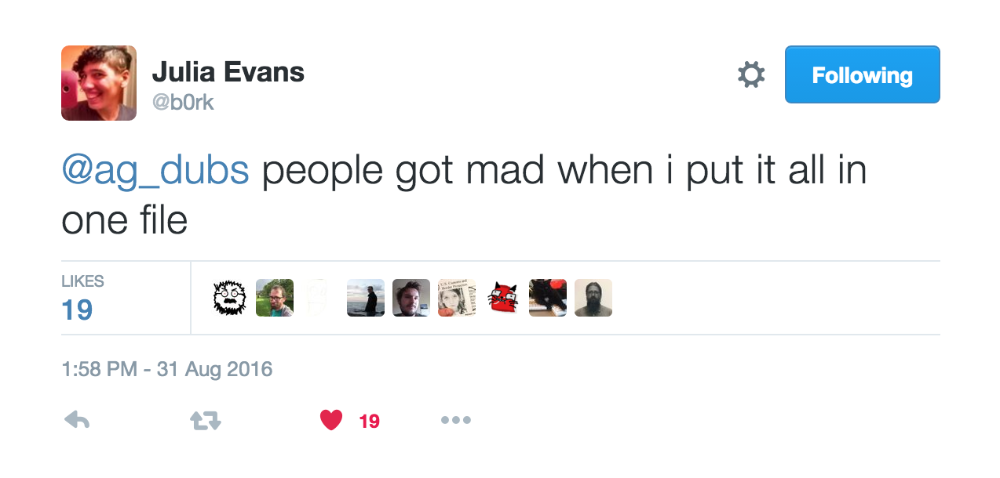

Ashley Williams ([@ag_dubs](https://twitter.com/ag_dubs)) explores in her talk why we even use modules, what separation of concerns means exactly, and what the costs and dangers of using modules are. And yes there's cost to modularity, that's why there are projects like [closure](https://github.com/google/closure-compiler), [prepack](https://github.com/facebook/prepack) and [tsickle](https://github.com/angular/tsickle) to alleviate them.

Her whole talk is available [online](https://www.youtube.com/watch?v=vypCsVm5z28), even the [slides](https://ashleygwilliams.github.io/jsconfeu-2017/#1). Awesome, check it out!

#### Aaaaaand ... Party!!

So while I was busy watching about 14 talks and having super delicious vegetarian meals with refreshing beverages in between, the whole day flew by in what feels like a blink of the eye.

Suddenly in the adjacent party location, I'm surrounded by flashing lights (even more than before), have a Gin&Tonic in my hands while the illustrious [LOOK MUM NO COMPUTER](https://www.youtube.com/channel/UCafxR2HWJRmMfSdyZXvZMTw) rocks away the stage and the crowd, shooting laser beams of analog-synthiness out of his synth-bike instrument.

  

Wait, what? - Yes, it's a bike and it's a music instrument. At the same time.

So we ride into the night.

## Day two

#### Dr. Franziska Hinkelmann - JavaScript Engines - how do they even?
I was still drowsy and bedazzled from all the impressions of the previous day, when Dr. Franziska Hinkelmann [@fhinkel](https://twitter.com/fhinkel) gave the audience solid insights into Chrome's [V8 JavaScript engine](https://developers.google.com/v8/). Hot functions, de-optimization bailout, just-in-time compilation, you'll learn about all of this. Both the [video](https://www.youtube.com/watch?v=p-iiEDtpy6I) and the [slides](https://fhinkel.github.io/JSEngines-HowDoTheyEven/assets/player/KeynoteDHTMLPlayer.html#0) are available online.

  

#### Marja Hölttä - Parsing JavaScript - better lazy than eager?
Thirsty for some more V8 deep diving? - So was I! Marja Hölttä ([@marjakh](https://twitter.com/marjakh)) tops of the previous talk with a comprehensive ride through JavaScript parsing and what you can do to make your page startup performance fast and sleek!

Apart from the [video](https://www.youtube.com/watch?v=Fg7niTmNNLg) and her [slides](https://docs.google.com/presentation/d/1b-ALt6W01nIxutFVFmXMOyd_6ou_6qqP6S0Prmb1iDs/edit#slide=id.p), she recommends reading Addy Osmani's [JavaScript Start-up Performance](https://docs.google.com/presentation/d/1b-ALt6W01nIxutFVFmXMOyd_6ou_6qqP6S0Prmb1iDs/edit#slide=id.p).

#### Emily Gorcenski - The Ethics of the Internet of Things
Emily Gorcenski's ([@EmilyGorcenski](https://twitter.com/EmilyGorcenski)) riveting talk about *The Ethics of the Internet of Things* completely took me by surprise. While they beautifully elaborate how big of a chance IoT devices are, they also elaborate how IoT devices could and already do create severe ethical and legal dilemmas. It is real. Way more than I thought!

In my opinion, the whole video is a [definitive must see for everyone](https://www.youtube.com/watch?v=xLL7Fo_em2E).

It also comes with a spot-on and a -granted- little dark punchline, that I could not resist to show you right away.

  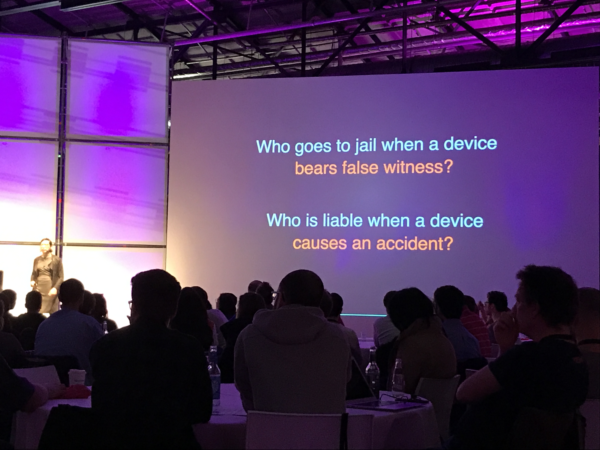
  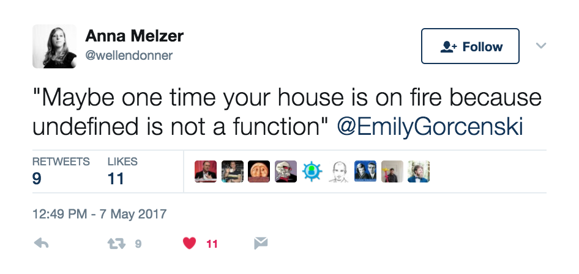

#### Jason Miller - Preact: Into the void 0
A performant 3kB alternative to React? Jason Miller ([@_developit](https://twitter.com/_developit)) shows how [Preact](https://github.com/developit/preact) came to be, dissects JSX and the Virtual DOM and probably serves the best slide of the whole conference, maybe even the universe:

  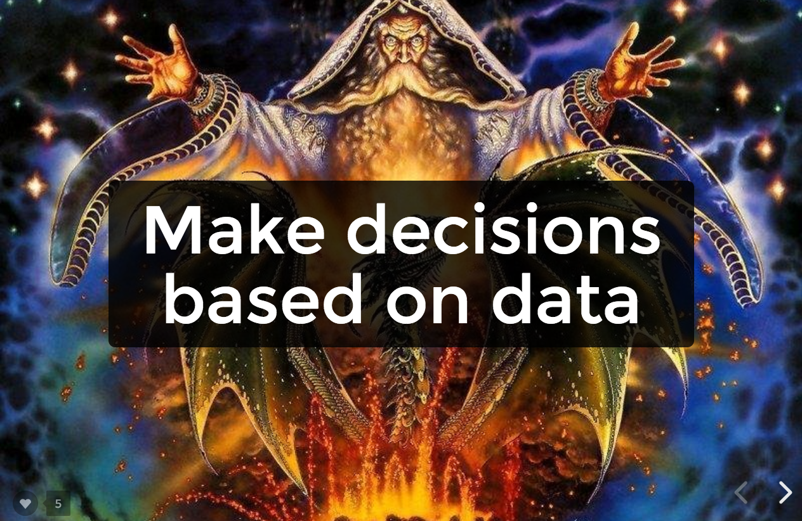

The [full video](https://www.youtube.com/watch?v=LY6y3HbDVmg) and [slides](http://slides.com/developit/preact-into-the-void0#/1) are available.

#### TC39 Panel
And last but not least, a personal favorite the TC39 Panel. This is a rare public gathering of a solid fraction of the people who form the Ecma TC39 Committee. Namely [@littledan](https://twitter.com/littledan) [@maggiepint](https://twitter.com/maggiepint) [@domenic](https://twitter.com/domenic) [@jasnell](https://twitter.com/jasnell) [@MylesBorins](https://twitter.com/MylesBorins). JavaScript is baked right here, they define the JavaScript language. It is maintained on [GitHub](https://github.com/tc39) and people can get easily involved.

Questions were posed live through [Twitter #tc39qs](https://twitter.com/hashtag/tc39qs) and were answered right on stage. So interesting to see!

One of the best quotes is by James:
*"standards made without community input are not good standards"* - [@jasnell](https://twitter.com/ag_dubs/status/861227966658998272)

  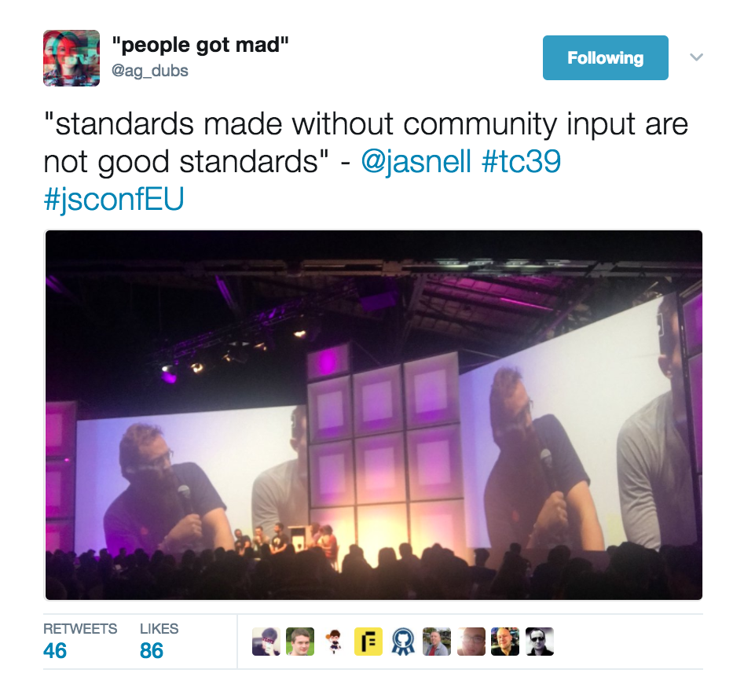

I recommend watching [the whole video](https://www.youtube.com/watch?v=cZTp2MaxcJg), it's worth it and gives valuable insights into how the language is made.

#### So many others...
I could go on and on until I recapped every single talk that I watched. Since I can't do that, here are some I still want to mention in no particular order. Some of these talks are already available on the [JSConf YouTube Channel](https://www.youtube.com/user/jsconfeu), others might be added in the future. Finger's crossed!

- Maggie Pint ([@maggiepint](https://twitter.com/maggiepint)) - Patterns for JavaScript Library Design
  - She's a maintainer of [moment.js](https://momentjs.com/) and part of TC39
  - The lesson, above all: [Make it easy to use!](https://twitter.com/frontsideair/status/861176599995183105)
- Rachel White ([@ohhoe](https://twitter.com/ohhoe)) - Keep the Internet Weird
  - Cursor effects. DHTML. Learning out of curiosity!
- Chris Pojer ([@cpojer](cpojer)) - Building High-Quality JavaScript Tools
  - Check out Facebook's [Jest](https://facebook.github.io/jest) JavaScript's new easy to port to testing framework.
- Emil Bay ([@emilbayes](https://twitter.com/emilbayes)) - Keeping passwords safe in 2017
  - md5, salted hashes, blowfish, [npm install secure-password](https://www.npmjs.com/package/secure-password)
- Zachary Johnson & Andrew Reitano - [NESpectre](https://twitter.com/thenespectre): The Massively Multi-Haunted NES
  - At one point about 200 people were collectively controlling Mario on the NES simulator with our mobile (we sucked!) while others were corrupting random memory slots to create WEEEEEEEIIIIIRD effects.
- Zahra Jabini ([@ZeeJab](https://twitter.com/ZeeJab)) - Sequential Art, Comics & SVGs
  - Check out her work at: [https://www.bustle.com/comics](https://www.bustle.com/comics)
- Lin Clark - A Cartoon Intro to WebAssembly.
  - [VIDEO!!](https://www.youtube.com/watch?v=HktWin_LPf4)
- ...
- many many many more!

  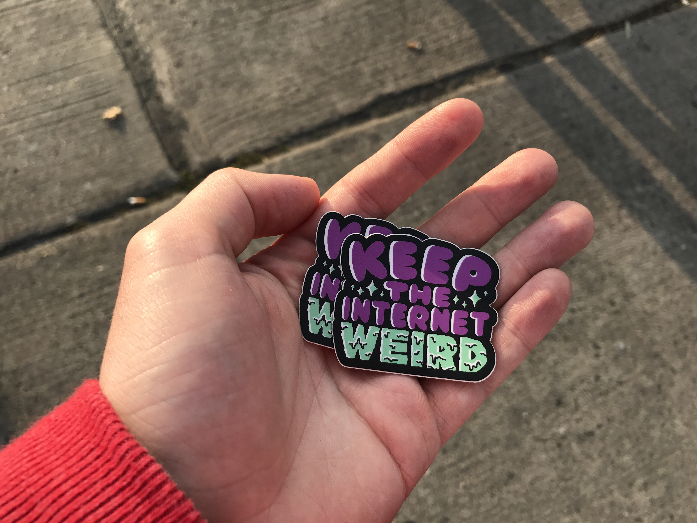
  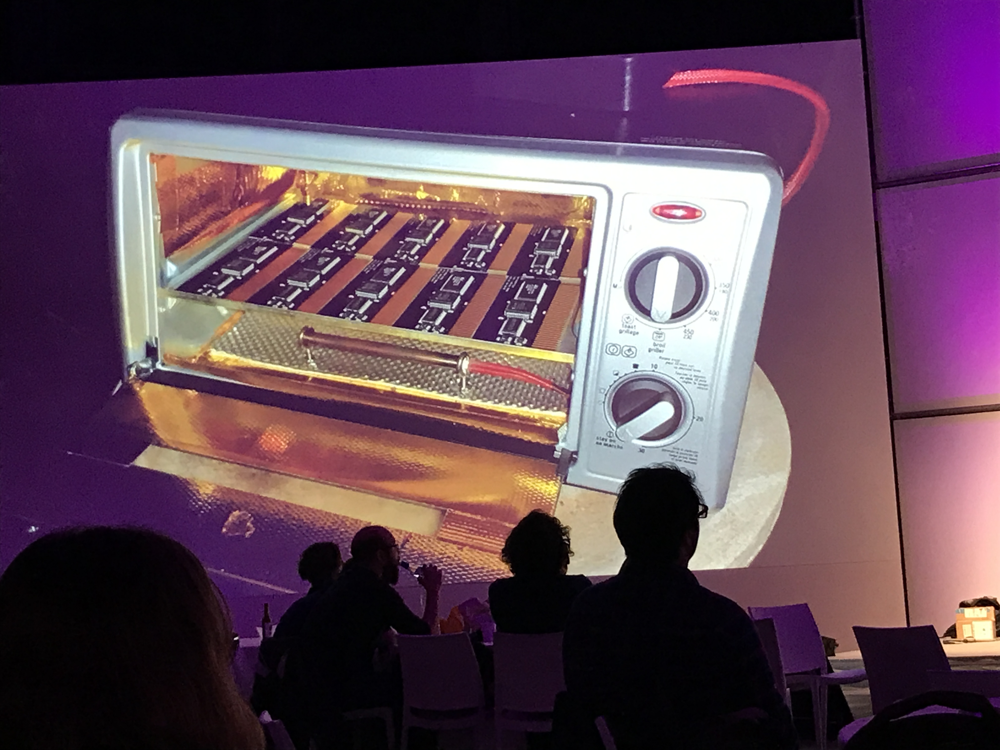
  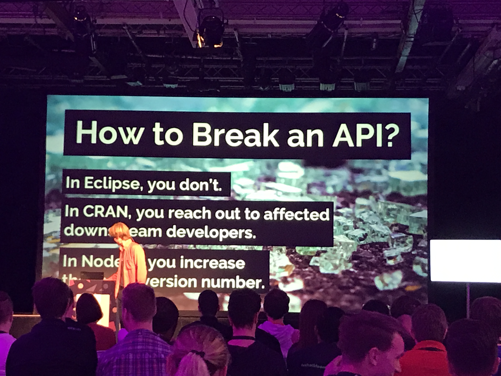

## Such a good conference

A few last words. Apart from all the amazing talks, there's a few other things I would like to mention and praise!

The whole conference felt so amazingly well organized, from start to finish. I was so impressed. While I was being busy shoving my face with complimentary frozen yogurt, deciding which awesome print I should get on my shirt, the whole days just flew by in their wholesome exhilarating greatness without any inconveniences. The food and catering was really, really good. Everything was taken care of from the first breakfast to the closing party at the unique [Hoppetosse](https://hoppetosse.berlin/).

  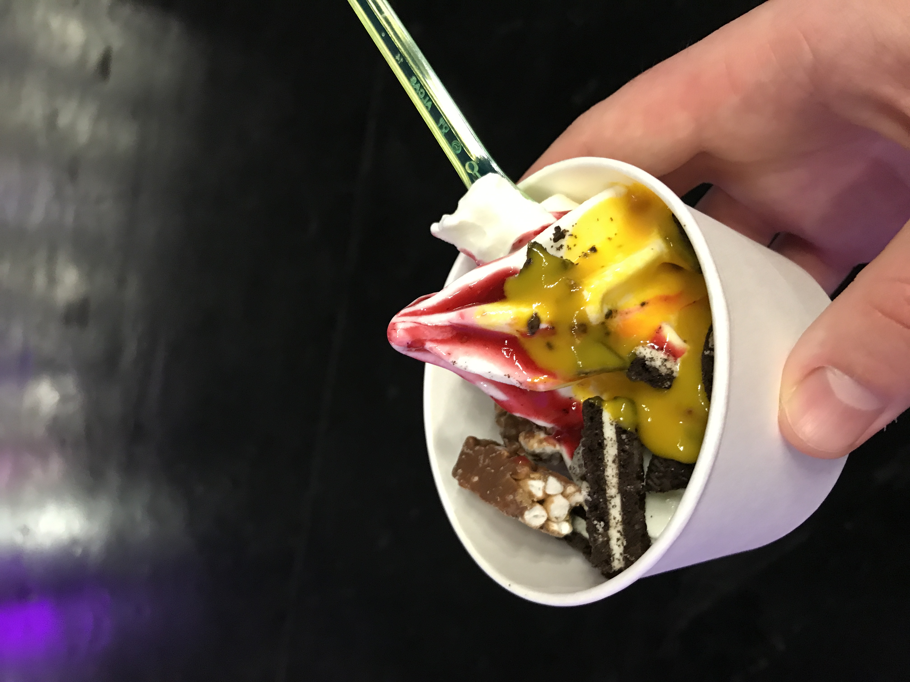
  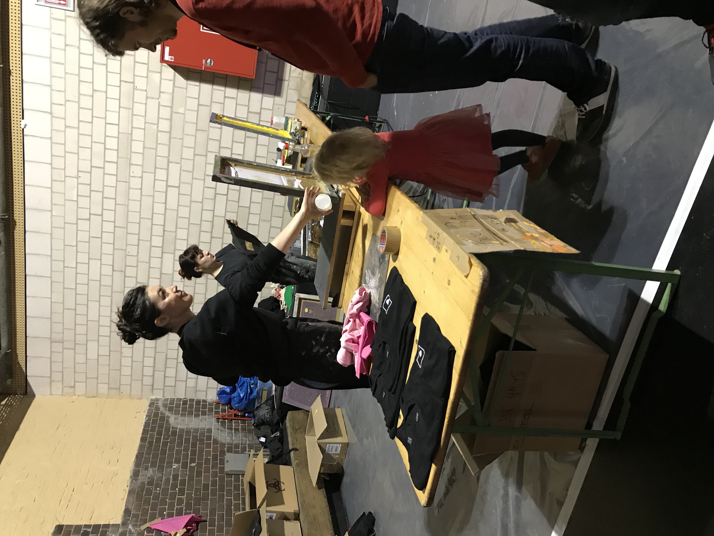
  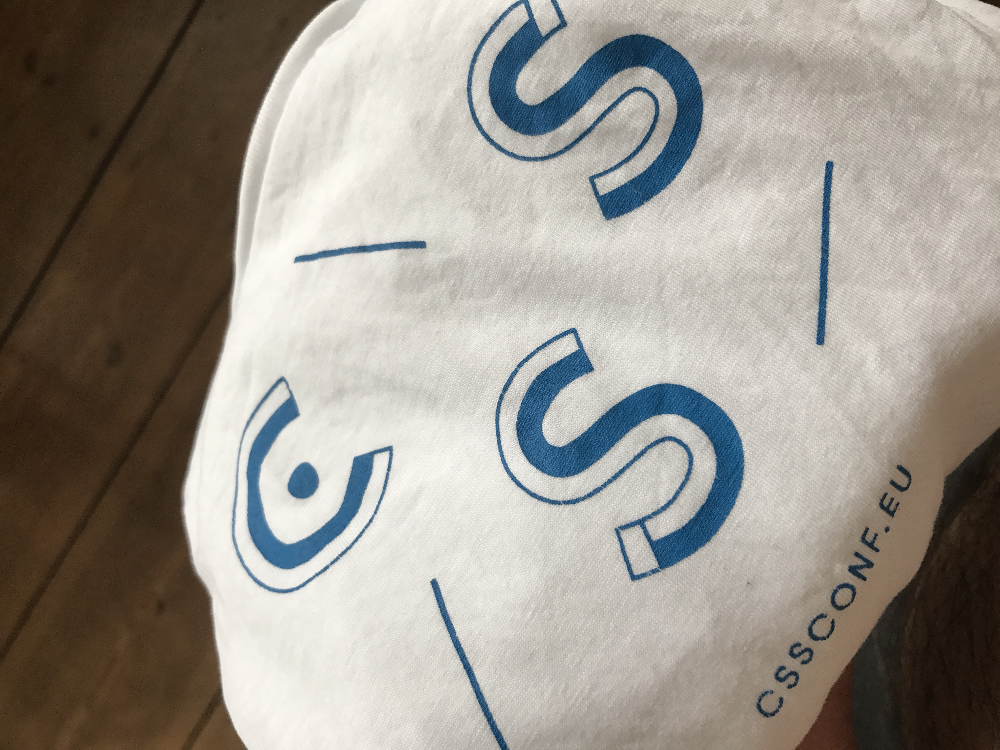

The location ([Arena Berlin](http://www.arena.berlin/)) was amazing itself and also amazingly well prepared: in between talks and in the breaks you could just unwind at the [Badeschiff](http://www.arena.berlin/veranstaltungsort/badeschiff/) beach for a while, there were chillout areas at the venue and as you could already see the stage was just phenomenal.

If you had nothing proper to do, there were so many fun things to roam around, so many treats and experiences: waiting for your coffee? Why not do a Google Cloud Service Coding Challenge, hang out at the community area and see people talk about their projects or get connected through the community board.

On top of everything, the whole atmosphere was so open and inclusive, starting with the gender-neutral bathrooms, the fact that every talk was transcripted live for those with special needs or even just small details like the color of your badge indicating whether it was ok to take pictures of you or not. So thoughtful.

Not in my life, I think, have I been so inspired and encouraged to be me. To use somebody else's words ([@nebrius](https://twitter.com/nebrius) who also talks about his JSConf experience on [medium.com](https://medium.com/@nebrius/an-open-love-letter-to-jsconf-eu-and-how-it-ended-my-2016-40f0b441e9d5)):

  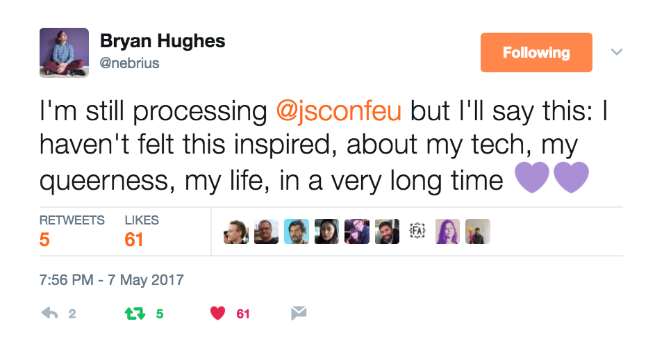

In the process I met so many amazing people: I played Exploding Kittens with [@porteneuve](https://twitter.com/porteneuve), casually chatted with [@whitneyhacks](https://twitter.com/whitneyhacks), [@maggiepint](https://twitter.com/maggiepint) and [@EmilyGorcenski](https://twitter.com/EmilyGorcenski) and even made some new friends, [@retzloff](https://twitter.com/retzloff) and [@karenzshea](https://twitter.com/karenzshea).

All of this led to such a memorable and valuable experience that I will not forget it in a lifetime.

Thank you to all the amazing people who made this possible. Especially the organizers: [@cramforce](https://twitter.com/cramforce), [@hblank](https://twitter.com/hblank), [@janl](https://twitter.com/janl), [@fox](https://twitter.com/fox)!

So what are my most valuable takeaways from the whole conference? - I'm a little torn, there's so much good content, I learned so many things.

On a technical level, for my day-to-day work I think it would be Addy Osmani's talk, whose optimization recommendations I will soon apply to the project we're currently working on, here at Nolte&Lauth. Another blog post incoming maybe? We'll see.

And on a personal level I want to close this post with a slide, of Whitney Williams ([@whitneyhacks](https://twitter.com/whitneyhacks)) whose quote I used for the title of this blog post.

Don't forget:

People first. Always.

  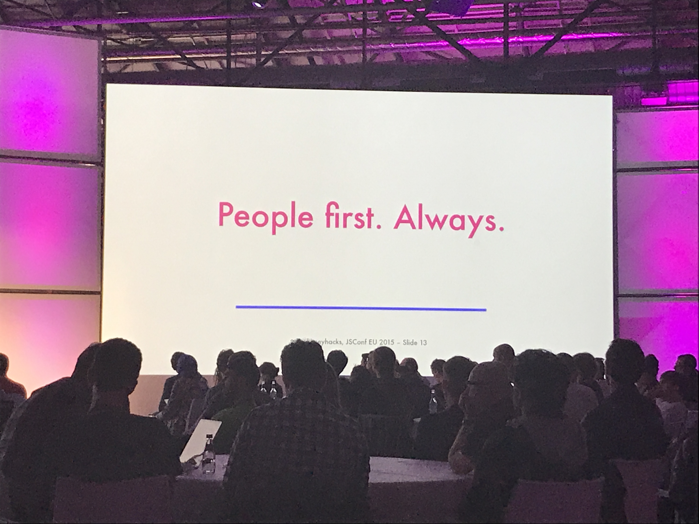

### TODOs
- proofread: grammar & spelling
- link images
- image titles
